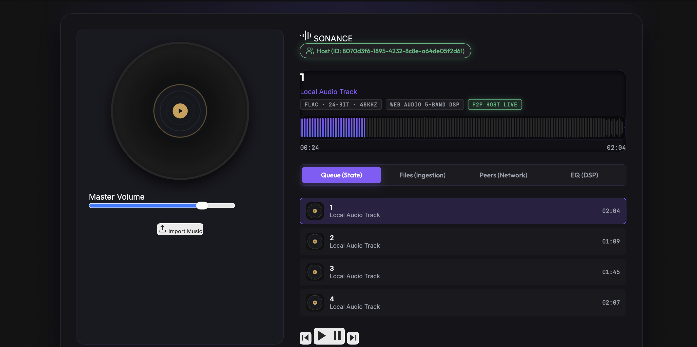

# 🎵 Sonance — Hi-Fi Music Player & WebRTC Remote Party

[](https://github.com/sahilsingh5967-debug/sonance/actions/workflows/ci.yml)
[](https://sonance.vercel.app)

> A high-performance Progressive Web Application built with **pure Vanilla JS (ES6 Modules)**, Web Audio API 5-Band DSP, Web Workers, Canvas Visualizers, and serverless WebRTC P2P audio streaming — zero frameworks, zero dependencies on runtime libraries.



---

## ✨ Key Features & Architecture Highlights

- **⚡ Zero Framework Architecture** — Pure Vanilla ES6 modules with a custom Pub/Sub `EventBus` for completely decoupled state & event management.
- **🎨 3 Official Listening Edition Themes** — Fully isolated CSS Custom Property design system with zero variable leakage and `localStorage` persistence:
  1. **`Aurora (Night Edition)`** — Original Dark Neon (OLED Deep Violet & Electric Accents).
  2. **`Opus (Signature Edition)`** — Ivory & Champagne Gold Luxury Hi-Fi *(Bang & Olufsen / Devialet inspired)*.
  3. **`Studio (Reference Edition)`** — Anodized Graphite & Warm Amber *(SSL Mastering Consoles & Hardware Workstations)*.
- **🎛️ 5-Band Web Audio DSP** — Real-time `BiquadFilterNode` equalizer at `60Hz · 250Hz · 1kHz · 4kHz · 12kHz` with instant hardware presets: *Flat, Rock, Pop, Jazz, Bass Boost, Electronic, Speech*.
- **🌐 WebRTC Remote Party (Binary Chunked Streaming)** — Serverless P2P audio file streaming over WebRTC DataChannels using **16KB binary chunking**, `serialization: 'binary'`, and async `canplay` state synchronization across Host and Guest sessions via PeerJS.
- **📈 Asynchronous Waveform Scrubber** — Off-main-thread peak extraction via Web Worker and `Float32Array` Transferable Objects for 60FPS UI scrubbing without frame drops.
- **📊 60FPS Multi-Mode Canvas Visualizer** — Real-time Spectrum Analyser, Oscilloscope Waveform, and Circular Radial visualizers using `AnalyserNode` + `requestAnimationFrame`.
- **📱 Progressive Web Application (PWA)** — Offline support, versioned Service Worker caching (`sonance-v1.0.0`), Network-First HTML navigation, and Stale-While-Revalidate static asset caching.
- **⌨️ Audiophile Command Palette & Shortcuts** — Quick action overlay (`Ctrl + Shift + P`) and global media keyboard shortcuts.

---

## 🎛️ 3 Official Listening Edition Themes

| Listening Edition | Visual Mood | Color Palette | Inspiration |
|---|---|---|---|
| **Aurora (Night Edition)** | Modern • Neon • Digital • OLED | Deep Obsidian `#07070A`, Electric Violet `#8B5CF6`, Deep Indigo `#6366F1` | Futuristic OLED Audio Displays |
| **Opus (Signature Edition)** | Luxury • Minimal • Satin Hi-Fi | Warm Ivory `#F8F7F3`, Champagne Gold `#C49A27`, Satin White `#FFFFFF` | Bang & Olufsen, Devialet, Leica |
| **Studio (Reference Edition)** | Industrial • Reference • Hardware | Anodized Graphite `#161616`, Studio Amber `#D7A628`, Carbon `#242424` | SSL Consoles, Universal Audio, Technics |

---

## 🌐 WebRTC Remote Party Audio Streaming Pipeline

```
[ Host MP3 File ]
       │
       ▼ (FileReader)
[ Raw ArrayBuffer ]
       │
       ▼ (16KB Chunking Engine)
[ Uint8Array Chunks (16384 Bytes) ]
       │
       ▼ (PeerJS DataChannel · serialization: 'binary')
[ WebRTC P2P Data Stream ]
       │
       ▼ (Guest Chunk Reassembly)
[ Combined Uint8Array ]
       │
       ▼ (Blob & Object URL)
[ audioElement.load()  →  await 'canplay' ]
       │
       ▼
[ Lock-Step Audio Playback Sync ]
```

---

## 🖥️ Audio Routing Architecture

```
[ HTMLAudioElement ]
        │
        ▼
[ MediaElementAudioSourceNode ]
        │
        ▼
[ GainNode  ←  Volume Ramping & Mute ]
        │
        ▼
[ BiquadFilterNode  60 Hz  ]
[ BiquadFilterNode  250 Hz ]
[ BiquadFilterNode  1 kHz  ]
[ BiquadFilterNode  4 kHz  ]
[ BiquadFilterNode  12 kHz ]
        │
        ▼
[ AnalyserNode  ←  FFT Size 256 ]
        │
        ▼
[ AudioContext.destination  →  🔊 Speakers ]
```

---

## ⌨️ Keyboard Shortcuts

| Shortcut | Action |
|---|---|
| `Space` | Play / Pause Toggle |
| `←` / `→` | Seek Backward / Forward 5 Seconds |
| `Ctrl` + `←` | Previous Track |
| `Ctrl` + `→` | Next Track |
| `M` | Toggle Mute |
| `Ctrl` + `Shift` + `P` | Open Command Palette |
| `Esc` | Close Command Palette / Overlay |

---

## ⚙️ CI / CD Pipeline

GitHub Actions triggers automatically on every push or pull request to `main`:

| Step | Task | Command |
|---|---|---|
| 1 | Checkout Repository | `actions/checkout@v4` |
| 2 | Environment Setup | Node.js 22.x LTS |
| 3 | Install Dependencies | `npm install` |
| 4 | Code Quality Audit | `npm run lint` *(ESLint + Prettier check)* |
| 5 | Automated Unit Tests | `npm test` |
| 6 | Automated Deployment | Vercel Production Build |

---

## 🛠️ Tech Stack

| Layer | Technology |
|---|---|
| **Core Architecture** | HTML5, CSS3 Scoped Design System, ES6 JavaScript Modules |
| **Audio Processing** | Web Audio API (`AudioContext`, `BiquadFilterNode`, `GainNode`, `AnalyserNode`) |
| **Multithreading** | Web Workers API (`waveformWorker.js`, `Float32Array` Transferables) |
| **Visual Rendering** | HTML5 Canvas 2D API, ColorThief Backdrop Extraction |
| **Networking** | WebRTC API, PeerJS (`serialization: 'binary'`) |
| **PWA & Storage** | Service Worker (`sw.js`), Cache API, `localStorage` |
| **CI / Tooling** | GitHub Actions, ESLint, Prettier, Node 22.x LTS |

---

## 🚀 Running Locally

Because Sonance uses **ES6 JavaScript Modules**, **Web Workers**, and **Service Workers**, it must be served over an HTTP web server (opening `index.html` via `file://` is not supported by browser security policies).

### Option 1 — Python 3 (Recommended)
```bash
# Navigate to directory
cd sonance

# Launch HTTP server on port 8000
python3 -m http.server 8000 --bind 127.0.0.1
```
Open **[http://127.0.0.1:8000](http://127.0.0.1:8000)** in Chrome, Safari, or Edge.

### Option 2 — Node.js `serve` / `http-server`
```bash
npx serve .
```

---

## ☁️ Deploying to Vercel

Pre-configured with `vercel.json` for clean URLs and immutable static asset headers:

```bash
npm i -g vercel
vercel --prod
```

---

## 👨‍💻 Developer

Built with ❤️ by **Sahil Singh** ([@sahilsingh5967-debug](https://github.com/sahilsingh5967-debug))
as part of the **CodeAlpha Frontend Development Internship**.
